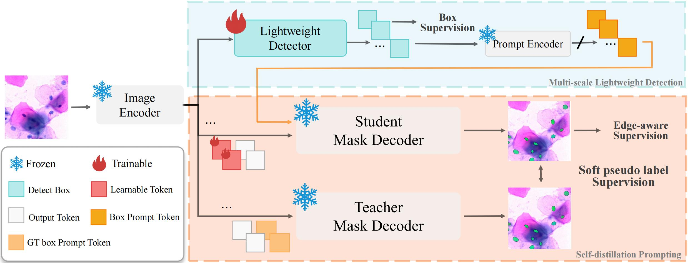
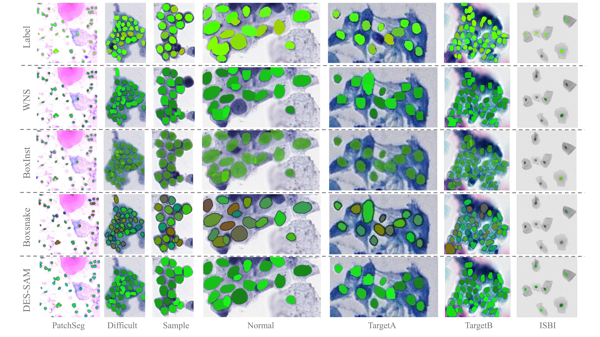

# DES-SAM

## Distillation-Enhanced Semantic SAM for Cervical Nuclear Segmentation with Box Annotation

[[`Model`](https://pan.baidu.com/s/1R1z8Z_iZQ7ZGbjUqvl1sfw?pwd=juwv)] [[`Paper`](#wait)] [[`BibTeX`](#Citation)]

Lina Huang, Yixiong Liang, JianFeng Liu

## Model Overview

<p align="center">
     <br>


  *Overview of DES-SAM model architecture*

</p>

## Install

On an NVIDIA 3090 Tensor Core GPU machine, with CUDA toolkit enabled.

1. Download our repository and open the DES-SAM
```
git clone git@github.com:CVIU-CSU/DES-SAM.git
cd DES-SAM
```

2. Install MMDetection [🛠️Installation](https://mmdetection.readthedocs.io/en/latest/get_started.html) and its dependencies

```Shell
# Step 1. Create a conda environment and activate it 
conda create --name dessam python=3.8 -y
conda activate dessam
# Step 2. Install PyTorch following official instructions, e.g.
pip install torch==1.13.1+cu116 torchvision==0.14.1+cu116 torchaudio==0.13.1 --extra-index-url https://download.pytorch.org/whl/cu116
# Step 3. MMDetection Installation 
pip install -U openmim
mim install mmengine
mim install "mmcv==2.0.1"
cd mmdetection
pip install -v -e .
# Step 4. Package Installation
pip install -r requirements.txt
# Step 5. SAM Installation
pip install segment-anything
```

## Results and Models

- **Visual Result**

<p align="center">
     <br>

- **Model Download**

The MMDetection based models can be accessed from [Baiduyun](https://pan.baidu.com/s/1R1z8Z_iZQ7ZGbjUqvl1sfw?pwd=juwv).

## Train & Test

[`Download`](https://pan.baidu.com/s/1R1z8Z_iZQ7ZGbjUqvl1sfw?pwd=juwv) the pretrained model to train DES-SAM.

Our code is based on coco datasets, datasets need to be converted to coco first.

```shell
# Train
CUDA_VISIBLE_DEVICES=0,1,2,3,4,5,6,7 bash ./tools/dist_train.sh {path}/mmdetection/configs/_des_sam_/PatchSeg/des-sam-patch.py 8 
```

```shell
# Test
CUDA_VISIBLE_DEVICES=0,1,2,3,4,5,6,7 bash ./tools/dist_test.sh {path}/mmdetection/configs/_des_sam_/PatchSeg/des-sam-patch.py {model_path} 8
```

## Acknowledgements
We would like to express our gratitude to the authors and developers of the exceptional repositories that this project is built upon: 
- [`MMDETECTION`](https://github.com/open-mmlab/mmdetection.git)
- [`CNSeg`](https://github.com/jingzhaohlj/AL-Net.git)
- [`SAM`](https://github.com/facebookresearch/segment-anything.git)
- [`VitDet`](https://github.com/facebookresearch/detectron2/tree/main/projects/ViTDet)
- [`Faster R-CNN`](https://github.com/ShaoqingRen/faster_rcnn.git)
- [`BoxSnake`](https://github.com/Yangr116/BoxSnake.git)
- [`BoxLevelSet`](https://github.com/LiWentomng/boxlevelset.git)

Their contributions have been invaluable to our work.

## Citation
If you find it useful for your your research and applications, please cite using this BibTeX:

```bibtex
@inproceedings{huang2024des-sam,
  title={DES-SAM: Distillation-Enhanced Semantic SAM for Cervical Nuclear Segmentation with Box Annotation},
  author={Lina Huang, Yixiong Liang and Jianfeng Liu},
  booktitle={International Conference on Medical Image Computing and Computer-Assisted Intervention (MICCAI)},
  year={2024},
  publisher={Springer}
}
```
